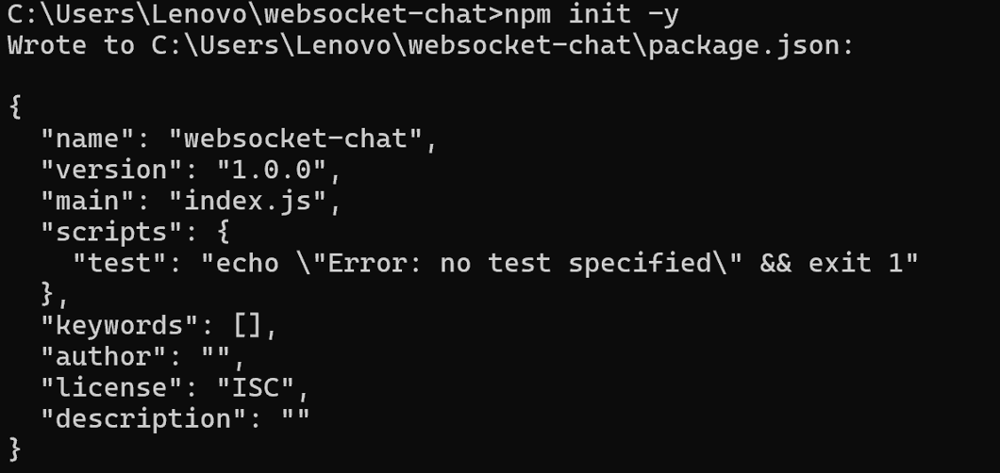
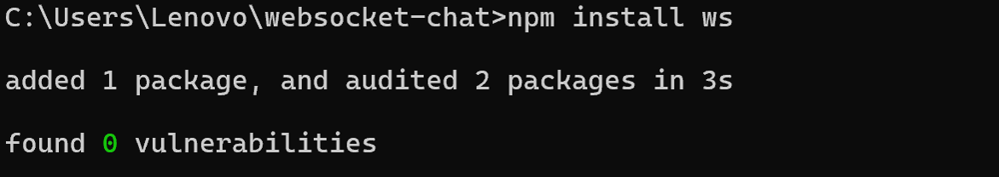
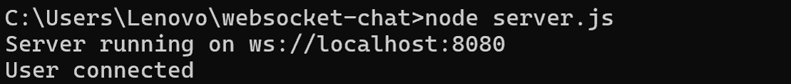
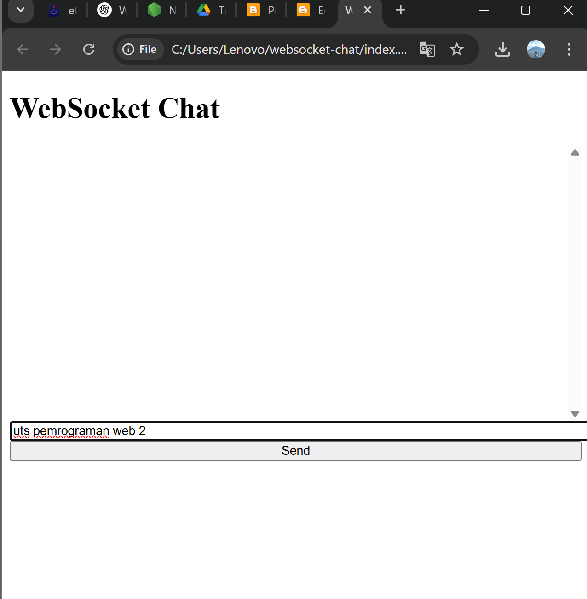
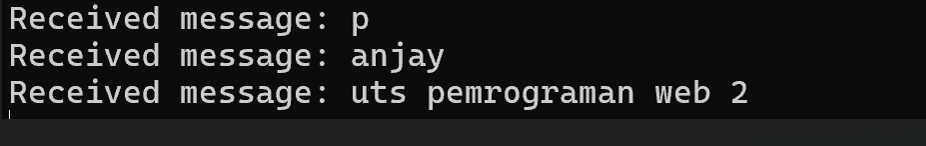
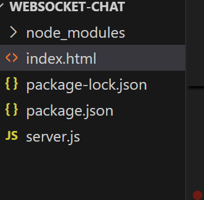

# WEBSOCKET CHAT EXPERIMENT

| UTS  |  Pemrograman Web 2  
|-------|---------
| NIM   | 312310610
| Nama  | Raul Putra Widodo
| Kelas | TI.23.A.6
| Dosen |  Agung Nugroho, S.Kom., M.Kom.

# Instalasi Node.js:

Pastikan ```Node.js``` sudah terinstal di sistem Anda. Unduh dan Instal dari ```situs resmi Node.js.```

# Buat folder baru untuk proyek anda

```mkdir websocket-chat```

```cd websocket-chat```


# Inisialisasi NPM

```npm init -y```

```npm install ws```





# Buat file server.js

Di dalam folder proyek, buat file server.js:

```const WebSocket = require('ws');
const wss = new WebSocket.Server({ port: 8080 });

wss.on('connection', (ws) => {
  console.log('User connected');
  
  ws.on('message', (message) => {
    console.log('Received message: ' + message);
    // Broadcast pesan ke semua client yang terhubung
    wss.clients.forEach(client => {
      if (client !== ws && client.readyState === WebSocket.OPEN) {
        client.send(message);
      }
    });
  });

  ws.on('close', () => {
    console.log('User disconnected');
  });
});

console.log('Server running on ws://localhost:8080');
```


# Menjalankan Server:

# Jalankan server di cmd (command prompt) dengan perintah berikut:

```node server.js```



# Mengatur Client

# Buat file ```index.html``` untuk antarmuka pengguna (UI):
```
<!DOCTYPE html>
<html lang="en">
<head>
  <meta charset="UTF-8">
  <meta name="viewport" content="width=device-width, initial-scale=1.0">
  <title>WebSocket Chat</title>
  <style>
    #messages { height: 300px; overflow-y: scroll; }
    input, button { width: 100%; }
  </style>
</head>
<body>
  <h1>WebSocket Chat</h1>
  <div id="messages"></div>
  <input type="text" id="messageInput" placeholder="Type a message..." />
  <button id="sendButton">Send</button>

  <script>
    const socket = new WebSocket('ws://localhost:8080');
    const messages = document.getElementById('messages');
    const messageInput = document.getElementById('messageInput');
    const sendButton = document.getElementById('sendButton');

    socket.onopen = () => {
      console.log('Connected to the server');
    };

    socket.onmessage = (event) => {
      const messageElement = document.createElement('div');
      messageElement.textContent = event.data;
      messages.appendChild(messageElement);
    };

    sendButton.onclick = () => {
      const message = messageInput.value;
      if (message) {
        socket.send(message);
        messageInput.value = '';
      }
    };
  </script>
</body>
</html>
```
# Menjalankan Client:

# Buka file ```index.html``` di browser untuk mulai berkomunikasi.



## client mengirim pesan ke server



## server menerima pesan dari client

# Struktur Folder

